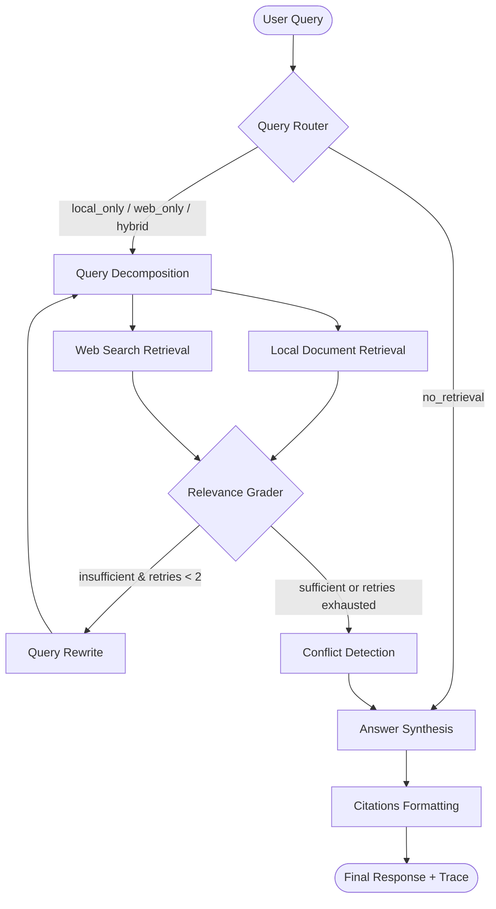

# InsightAgent: Multi-Source Agentic Research Analyst

InsightAgent is an agentic RAG research assistant that intelligently handles user queries by routing them across local documents (PDFs) and live web search, decomposing complex prompts, self-correcting on weak retrievals, and resolving factual conflicts between stale and current information. It produces well-cited, synthesized answers alongside a live reasoning trace on the frontend.

## Key Agentic Features

Unlike standard "retrieve-and-generate" RAG architectures, InsightAgent exhibits true **agentic autonomy** via the following mechanisms:

1. **Intelligent Query Routing**: An LLM-based router classifies queries dynamically into `local_only` (curated reports/PDFs), `web_only` (real-time web search), `hybrid` (requiring both), or `no_retrieval` (general capability/small talk).
2. **Query Decomposition**: Compound or multi-hop questions are broken down into atomic sub-queries and solved independently.
3. **Self-Correction & Bounded Retry Loop**: Chunks retrieved from local or web sources are graded by the LLM. If relevance is graded as `insufficient`, the agent automatically reformulates the query, increments its retry count, and tries retrieval again (bounded to a maximum of 2 retries to prevent loops).
4. **Factual Conflict Detection**: If local and web search findings disagree (e.g., outdated statistics in an uploaded PDF vs. recent figures on the web), a dedicated comparison node detects the contradiction. Rather than silently merging or picking one, the final answer explicitly highlights the conflict and cites both sources.
5. **SSE Reasoning Trace**: The backend streams execution steps in real time via Server-Sent Events (SSE). The frontend displays a live collapsible "Thinking Trace" panel showing each decision, sub-query, grading check, and retry.

---

## High-Level Architecture

The system is orchestrating via **LangGraph** (StateGraph) for the control flow, **ChromaDB** for local vector search, and **Groq / Tavily** for inference and search.



---

## Folder Structure

```
insightagent/
├── backend/
│   ├── app/
│   │   ├── main.py                 # FastAPI application entrypoint
│   │   ├── config.py               # Central configuration (models, thresholds)
│   │   ├── routers/                # FastAPI routers (chat, upload, documents)
│   │   ├── agent/                  # LangGraph Agent Core
│   │   │   ├── graph.py            # Graph definition & compilation
│   │   │   ├── state.py            # TypedDict state tracking schema
│   │   │   ├── nodes/              # Node functions (router, grade, conflict, etc.)
│   │   │   └── prompts/            # Versioned prompt templates
│   │   ├── ingestion/              # Ingestion pipeline (parsing, chunking)
│   │   ├── vectorstore/            # ChromaDB local persistence client
│   │   └── services/               # LLM (Groq) and Web Search (Tavily) clients
│   └── tests/                      # Verification and test runner scripts
└── frontend/
    └── app/                        # Next.js App Router UI
        ├── components/             # ChatWindow, Citations, and Reasoning Trace panels
        └── lib/                    # API client fetching SSE streams
```

---

## Setup & Running Instructions

### 1. Environment Configurations
First, create the environment variables files for both backend and frontend.

- **Backend (`backend/.env`)**:
  Create a `.env` file in the `backend/` directory with your Groq and Tavily keys:
  ```env
  GROQ_API_KEY=gsk_xxx...
  TAVILY_API_KEY=tvly-xxx...
  ```
- **Frontend (`frontend/.env.local`)**:
  Create a `.env.local` file in the `frontend/` directory pointing to the backend host:
  ```env
  NEXT_PUBLIC_API_URL=http://localhost:8000
  ```

---

### 2. Start the Backend Server

```powershell
# Navigate to backend
cd backend

# Create and activate virtual environment
python -m venv venv
# On Windows PowerShell:
.\venv\Scripts\Activate.ps1
# On macOS/Linux:
source venv/bin/activate

# Install dependencies
pip install -r requirements.txt

# Start uvicorn server on port 8000
uvicorn app.main:app --port 8000 --reload
```

---

### 3. Start the Frontend Server

```bash
# Navigate to frontend
cd frontend

# Install packages
npm install

# Start Next.js dev server on port 3000
npm run dev
```

---

## Verification & Automated Testing

InsightAgent includes an automated system-wide test suite to verify routing accuracy, citation structures, trace completeness, and response times across all four routing categories.

### Step 1: Index Sample Document
Generate a 3-page mock PDF report containing 2024 statistics on Pakistan's IT export values and tax policies, and upload/index it into ChromaDB:
```powershell
# Make sure uvicorn server is running on port 8000
cd backend
.\venv\Scripts\python.exe tests/generate_test_pdf.py
```

### Step 2: Run 20-Question Automated Test Suite
Execute the automated test script to evaluate routing classification accuracy:
```powershell
cd backend
.\venv\Scripts\python.exe tests/run_tests.py
```
This script queries the backend endpoints sequentially, performs quality checks, and generates a structured report inside `backend/tests/test_report.md` evaluating the agent's accuracy and performance.
